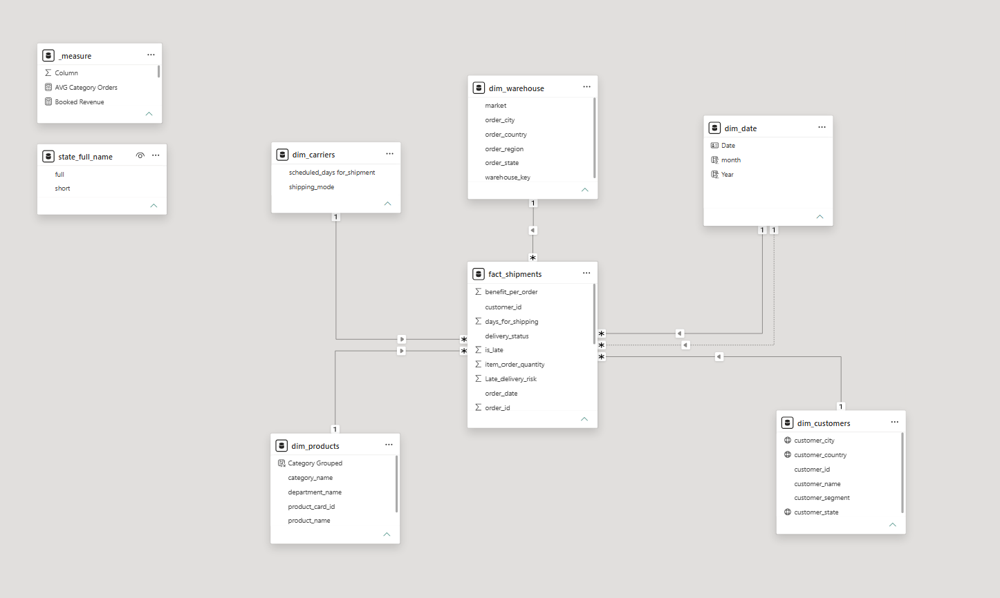
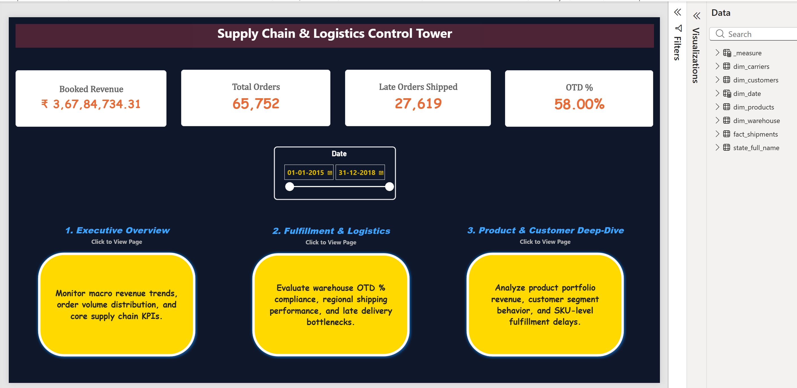
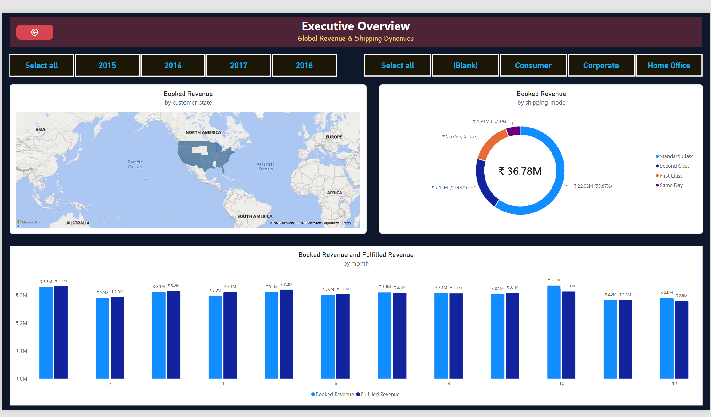
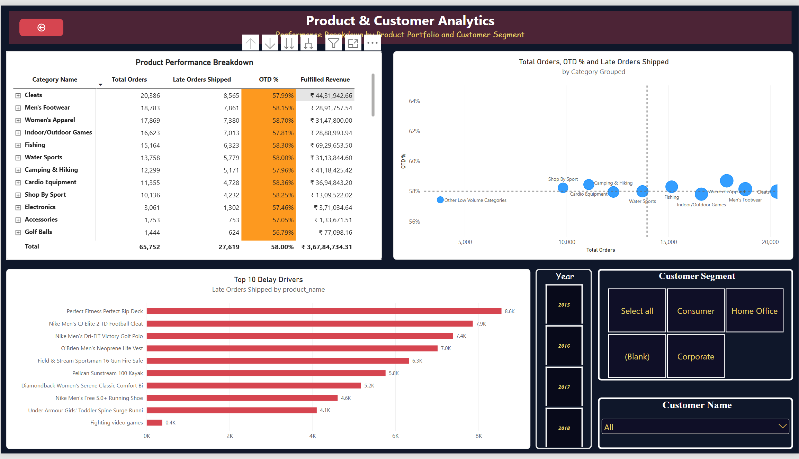

# Supply Chain & Logistics Control Tower

An interactive **Power BI** dashboard designed to track organizational order performance, fulfillment pipelines, and regional shipping dynamics across global customer segments.

## 📌 Project Overview

This dashboard serves as a central reporting tool for monitoring commercial performance and logistical efficiency. By connecting customer demographics, order fulfillment metrics, and temporal dimensions, it provides decision-makers with actionable insights into revenue realization and regional distribution.

## Dashboard Screenshots

### 1. Model View

### 2. Landing Page

### 3. Page 1 / Executive Overview

### 4. Page 2 / Fulfillment & Logistics

### 5. Page 3 / Product & Customer Analytics

## ✨ Key Features & Capabilities

* **Executive Revenue Tracking:** Side-by-side performance comparison of **Booked Revenue** vs. **Fulfilled Revenue** broken down by month and customer segment (*Consumer*, *Corporate*, *Home Office*).
* **Geographical Distribution:** Spatial visualization mapping order volumes across US states and territories with interactive drill-down capabilities (`State` $\rightarrow$ `City`).
* **Fulfillment Monitoring:** Interactive filtering across multi-year performance periods to identify seasonal bottlenecks and shipment velocity.

## ⚠️ Challenges & Technical Limitations

1. **High-Density Map Rendering Limits:**
   * *Challenge:* Plotting high-granularity spatial data (`customer_city`) across thousands of order rows triggered Power BI's visual data capacity limit (*"Too many values"* error).
   * *Resolution/Workaround:* Implemented a structured location hierarchy allowing users to view data aggregated at the state level by default, with drill-down functionality to inspect individual cities on demand.

2. **Geographic Data Standardization:**
   * *Challenge:* Source records contained inconsistent two-letter state abbreviations, non-standard territory codes, and missing values.
   * *Resolution:* Built a custom 2-column reference lookup table in Power Query to merge, align, and replace abbreviated codes with full state/territory names, maintaining primary key integrity at the line-item level.

## 💻 Tools

PowerBI, Power Query, DAX, Excel

